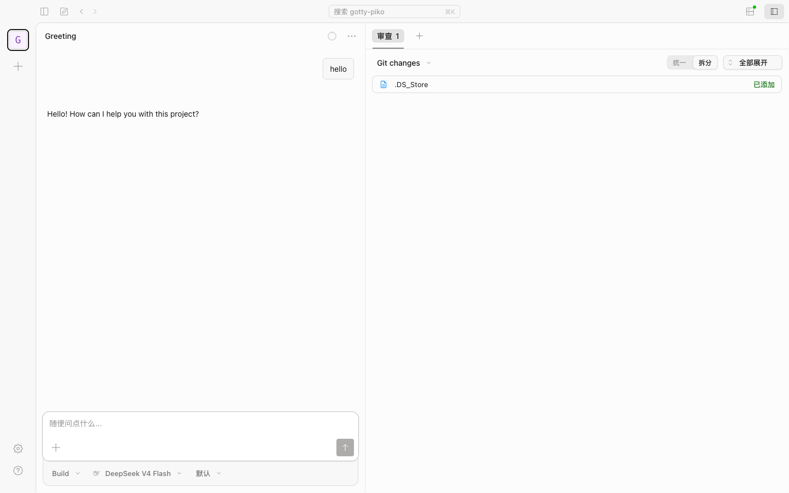

# opencode-piko-remote

[English](README.md) | [简体中文](README_ZH.md)

通过 [piko](https://github.com/andydunstall/piko) 隧道远程暴露 [opencode](https://github.com/anomalyco/opencode) 的 Web 界面。

## 界面预览



## 架构

```
[浏览器] → [Piko Server (nginx + piko)] → [Piko Agent] → [opencode web]
```

客户端二进制文件内嵌 opencode，以 Web 模式启动，并通过 piko 连接到远程服务器——让你的 AI 编程助手随时随地可访问。

## 快速开始

### 一键安装

```bash
curl -fsSL https://raw.githubusercontent.com/friddle/opencode-piko-remote/main/install.sh | bash
```

脚本会自动检测操作系统/架构，下载最新的二进制文件到 `~/.opencode-piko/bin/`，并添加到 `$PATH`。

```bash
# 安装指定版本
curl -fsSL https://raw.githubusercontent.com/friddle/opencode-piko-remote/main/install.sh | bash -s -- --version 0.1.0
```

重启终端后即可使用。

### 客户端（你的开发机）

```bash
opencode-piko /path/to/project \
  --name=my-dev \
  --remote=piko-server.example.com:8088 \
  --pass=your-password
```

然后在浏览器中访问 `http://piko-server.example.com:8088/my-dev/`。

### 服务端（公网，Docker 部署）

```bash
cd server
docker compose up -d
```

暴露端口：
- `:8088` — HTTP 访问（nginx → piko 代理，按 endpoint 名称路由）
- `:8022` — Piko 上游端口（供客户端连接）

## 客户端参数

| 参数 | 必填 | 默认值 | 说明 |
|------|------|--------|------|
| `[project]` | 否 | `.` | opencode 的工作目录 |
| `--name` | 是 | — | Piko endpoint 名称（同时也是 URL 路径） |
| `--remote` | 是 | — | Piko 服务器地址 `host:port` |
| `--user` | 否 | `opencode` | 认证用户名 |
| `--pass` | 否 | — | 认证密码 |
| `--server-port` | 否 | `8022` | Piko 上游端口 |
| `--auto-exit` | 否 | `true` | 24 小时后自动关闭 |

## 命令

```bash
opencode-piko [project] [flags]   # 启动服务
opencode-piko upgrade             # 更新内嵌的 opencode 到最新版本
```

## 构建

```bash
cd client

# 当前平台
make build

# 全部 4 个平台 (darwin/linux × amd64/arm64)
make build-all

# Docker 镜像
make docker
```

需要 Go 1.23+ 及网络连接（构建时会从 GitHub Releases 下载 opencode）。

## Docker（客户端）

```bash
cd client
make download-opencode TARGET_OS=linux TARGET_ARCH=amd64
make docker
docker run -d opencode-piko:latest --name=dev --remote=your-server:8088 --pass=secret
```

## 工作原理

1. 首次运行时，将内嵌的 opencode 二进制文件解压到 `~/.opencode/bin/`
2. 在随机本地端口上启动 `opencode web`，并设置 `OPENCODE_SERVER_PASSWORD`
3. 启动 piko agent 连接到远程 piko 服务器
4. 流量流向：浏览器 → piko 服务器 → piko agent → opencode web

## License

MIT
